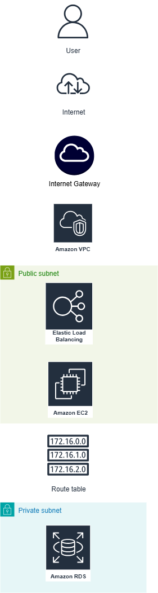

# 🏗️ Cloud Architecture Design: Scalable Blogging Platform (AWS)

This project is a professional level cloud architecture design for a scalable blogging application on AWS. It demonstrates best practices in designing for scalability, fault tolerance, and cost efficiency the kind used in real world DevOps and Solutions Architecture roles.

---

## 🌐 Architecture Overview

This design includes:

- **Frontend**: React app hosted on S3 + delivered via CloudFront
- **Backend**: EC2 instances behind a Load Balancer with Auto Scaling
- **Database**: RDS (MySQL) with Multi-AZ deployment
- **Networking**: Custom VPC, public/private subnets, IGW, NAT Gateway
- **Security**: Security Groups, IAM Roles, Private Networking

---

## 🖼️ Architecture Diagram

 Open `architecture-diagram.drawio` or view the image below:_

---

## 🛠️ Design Principles

| Area          | Design Choice & Why |
|---------------|----------------------|
| **High Availability** | Multi-AZ RDS + Auto Scaling backend |
| **Security**           | Private subnets for EC2/RDS + SGs |
| **Scalability**        | ALB + Auto Scaling Group (backend) |
| **Performance**        | CDN via CloudFront for faster frontend |
| **Cost Optimization**  | NAT gateway only in 1 AZ, S3 for frontend |

---

## 📁 Folder Structure

cloud-architecture-design/
├── architecture-diagram.drawio
├── architecture-diagram.png
├── README.md
└── notes/
└── design-decisions.md

---

## 🧠 Why I Built This

Designing before building is how real engineers and cloud architects work. I created this to sharpen my ability to think at the system level balancing security, performance, and cost. It’s more than just diagrams  it’s how you plan systems that work.

---

## 👨‍💻 Author

**Mosehla Charles Maponya**  
Cloud & DevOps Enthusiast | GitHub: [CharlesMCMaponya](https://github.com/CharlesMCMaponya)  
[LinkedIn](https://www.linkedin.com/in/mosehla-charles-maponya/)
